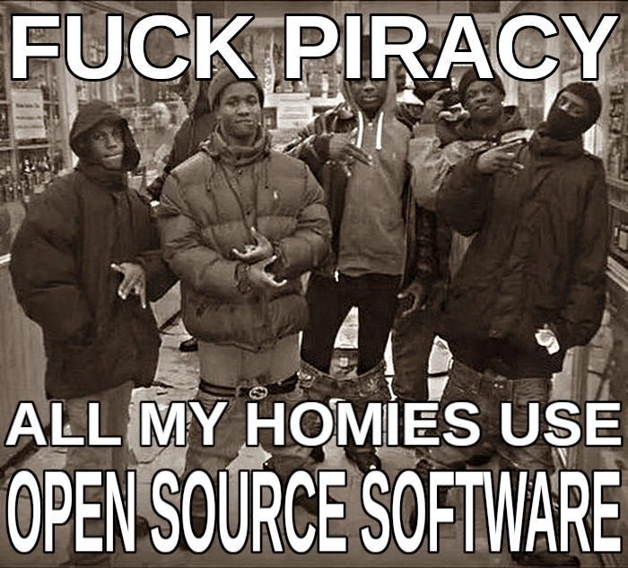

# 👊 Wazzup, homie. I’m Timofey Kirichenko

💉 Code drip runnin’ thru my veins, brain on that byte hustle — no games, just grindin’ and buildin’.  

🎓 Reppin’ **ITMO**, 2nd year CE — while they stuck on them textbooks, I’m out here flippin’ code like fresh mixtapes, straight fire. 🎤🔥

---

### 🔥 What I'm Cookin'

- **HateEngine** — Retro-style game engine throwin’ back to early 2000s vibes, but runnin’ clean on them new rigs too. Straight flex.  
- **NCVM** — Custom VM I built from scratch, no shortcuts, no copy-paste — pure hustle and grind. 💀

---

### 🛠️ What I’m Grindin’ On

- 💥 3D graphics — pushin’ pixels, droppin’ shaders, makin’ scenes pop like it’s hot 🔥  
- ⚔️ Low-level kung fu — crackin’ opcodes, stackin’ memory bricks, keepin’ it raw and real 🧙‍♂️

---

> From dorm room dreams to real-deal schemes — this ain’t no joke, it’s the real come-up.  
> 💻🎮 Byte flipper, memory hacker, digital hustla — stay woke, stay sharp, stay grindin’.  
> **Real recognize real.** 👑

       
---

<!-- Proudly created with GPRM ( https://gprm.itsvg.in ) -->

    

