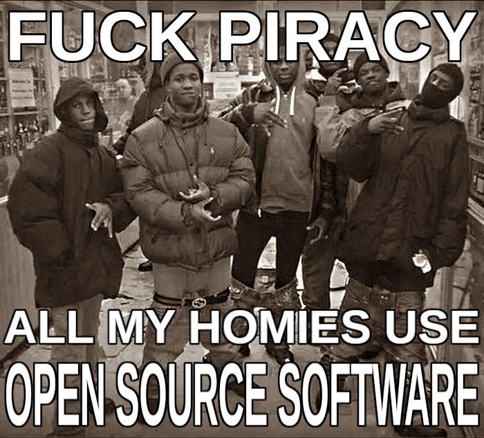

# Timofey Kirichenko

ITMO, 3rd year CE student

## My Stack

- **OS**: Void Linux (just based)
- **WM**: Niri
- **Editor**: Helix
- **Languages**: Rust and C

## Interested In

Low-level stuff in general. I have some experience building programming languages and compilers, VMs and ISAs, and game engines.

Right now I'm diving into embedded development and RTL design. I also want to understand how to program under Linux — drivers, modules, and the like.

## My Projects

- **HateEngineRuntime** — modern game engine for old PCs, written in pure C99. WIP, currently suspended.
- **ITMO-SCAC** — study project: my own programming language, compiler, ISA, and CPU simulator. Code quality is shit, be carefull.
- **Lily58 Firmware** — firmware for my custom Lily58 keyboard, written in Rust. I use it daily, currently rewriting it in C.
- **NCVM** — an attempt at a virtual machine for embeddable programming languages. It works, but the ISA is shit and needs a rewrite.

<!--     -->

    

